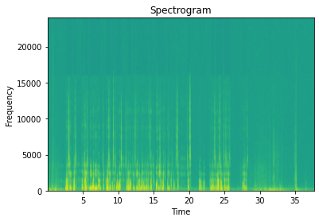

# AdaptiCon
This is the wiki for a new multi-year project in LAB lab on phonetic adaptation. The proper full name of the project is *Adaptations in Conversations* and it started circa mid-2022.

We have split the project into three main portions:

[AdaptiCon-Vowel](https://github.com/SFU-LAB/adapticon/blob/51120e74e563fe5a75c80b80bad93ad7d5329a07/adapticon-vowel.md) is mainly concerned about adaptations in English.

[AdaptiCon-Tone](https://github.com/SFU-LAB/adapticon/blob/51120e74e563fe5a75c80b80bad93ad7d5329a07/adapticon-tone.md) is mainly concerned about adaptations in Cantonese tones.

[AdaptiCon-AI](https://github.com/SFU-LAB/adapticon/blob/51120e74e563fe5a75c80b80bad93ad7d5329a07/adapticon-ai.md) is mainly concerned about adaptations between a human and a non-human voice.

[This](https://github.com/SFU-LAB/adapticon/tree/main/Papers) is a list of all literatures we have read and reviewed.

[This](https://github.com/SFU-LAB/adapticon/blob/51120e74e563fe5a75c80b80bad93ad7d5329a07/Useful%20Resources.md) is a list of useful resources we have found during our research.

[Method]()

[Project Plan]()

# Physical Setups

Audio: 
1. Rode Wireless Go II with Lapel mics, each participant wears one.
2. NT2-A, set to Cardioid mode, each participant gets one pointing to them.
3. Recorder: TASCAM DR70D
4. Note: there's self-noise from the mic
  
Computer (to be confirmed):
1. Mac Mini with 2 virtual machines, each participant get one with separate controllers and displays
2. 2 x VESA monitors, VESA to C-Stand mounts, and actual C stands
    
Video Recording:
1. 2 cameras pointing at the participants face.   
2. 2 cameras outputs to ATEM mini pro, 2 monitors as well (using HDMI split).
3. HDMI recorder (Atomos Ninja V) recording outputs of the ATEM mini pro.

Equipment list (TODO)

* [General Noise Floor measurement](https://www.avisoft.com/noisefloors.pdf)
* NTG2 (Left/Top) vs NT2a (Right/Down) spectrogram comparison

